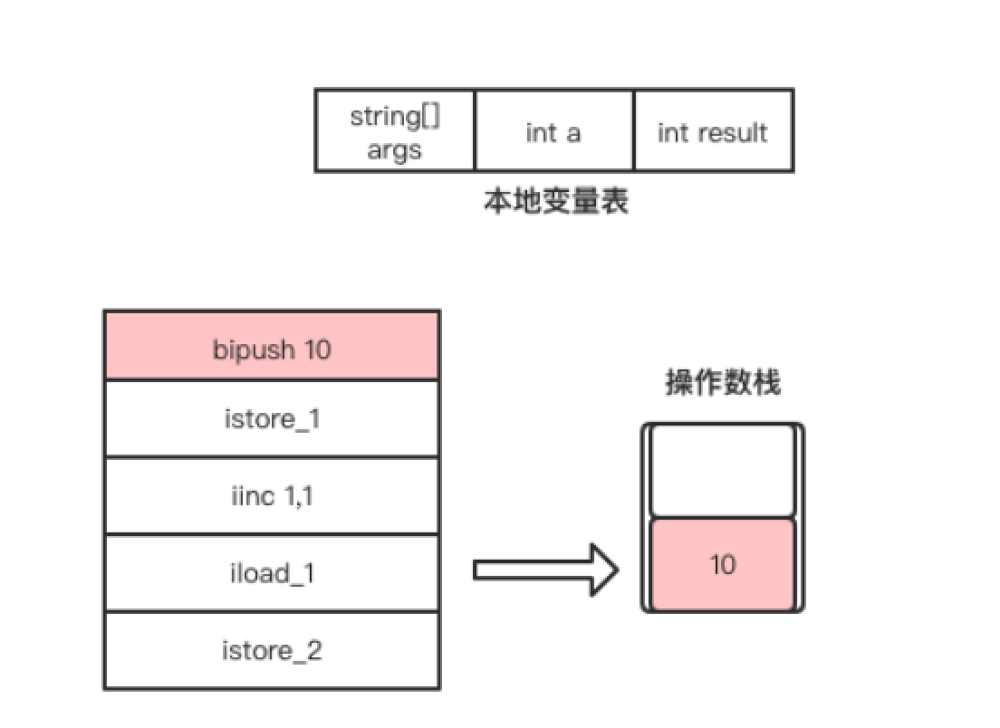
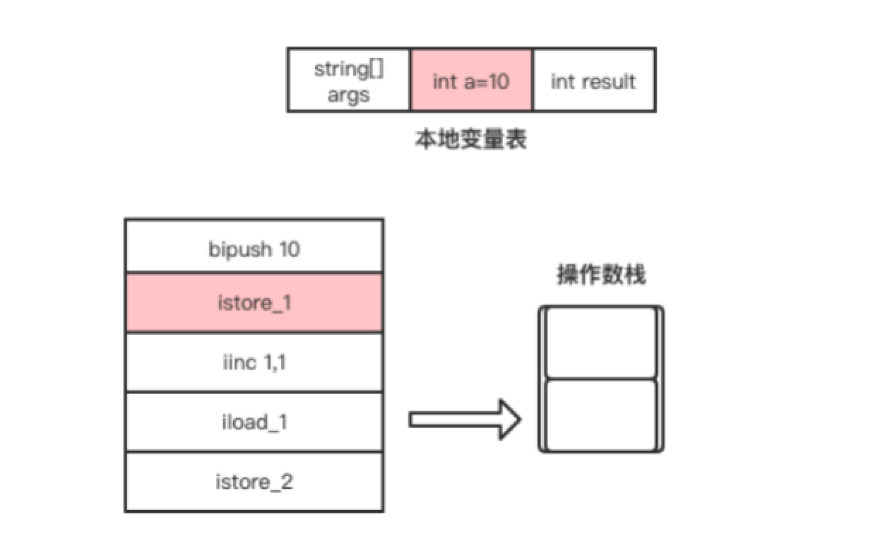
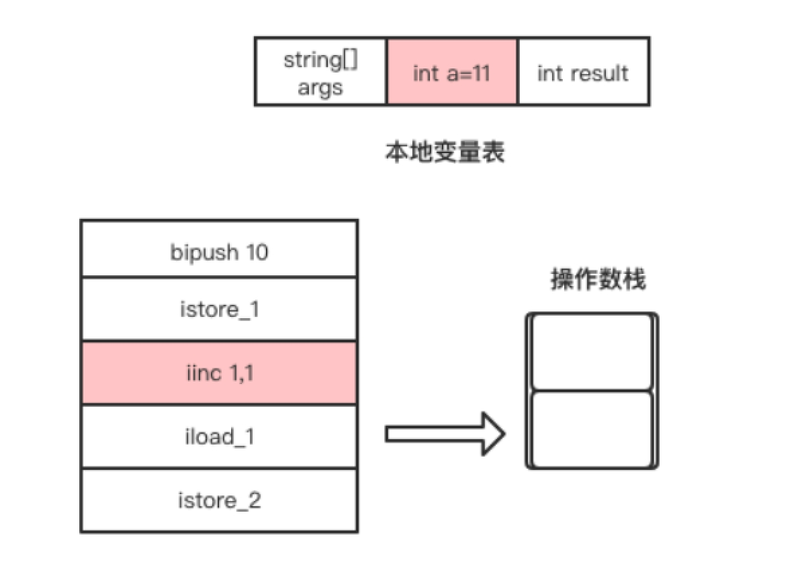
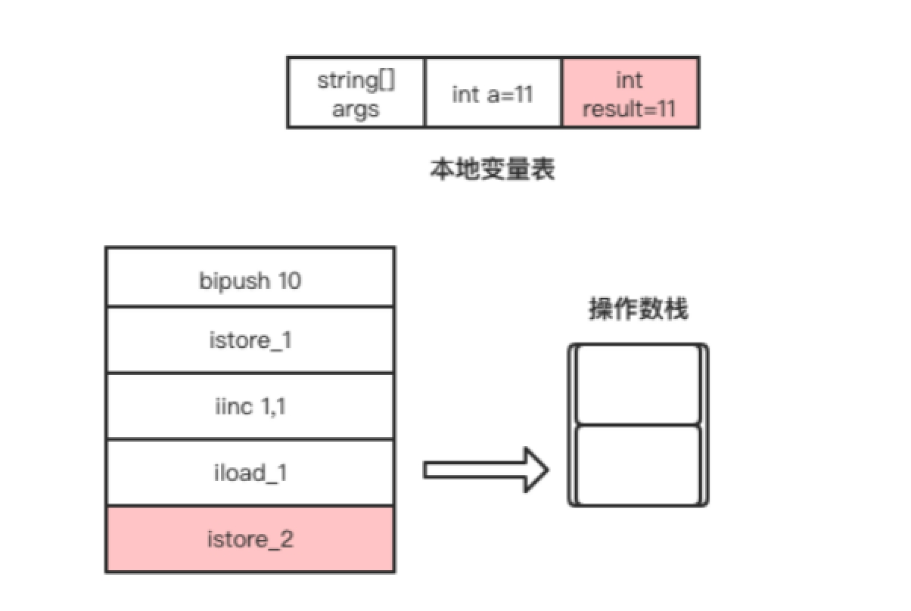

# 基于栈的指令集架构


在汇编语言中，除直接内存操作的指令外，其它指令的执行都依赖寄存器，如跳转指令、循环指令、加减法指令等。汇编指令集是由硬件直接支持的，不同架构的CPU提供的汇编指令集也会不一样[^1]。

 以一个经典的++i面试题为例，使用c语言编写的实现如下。

```c++
int m = ++i; 
```

反汇编后对应的32位x86 CPU的汇编指令如下。

```assembly
inc dword ptr [ebp-44h]  
mov eax,dword prt [ebp-44h]  
mov dword ptr [ebp-4ch],eax  
```

这三条指令的意思是，先将[ebp-44h]内存块存储的值加1，而dword ptr相当于c语言中的类型声明。接着将[ebp-44h]内存块存储的值放入到eax寄存器，最后将eax寄存器存储的值放到[ebp-4ch]内存块，也就是赋值给变量m。由于i和m是在栈上分配的内存，因此[ebp-44h]对应i的内存地址，[ebp-4ch]对应m的内存地址。

汇编指令不能直接操作将一块内存的值赋值给另一块内存，必须要通过寄存器。32位x86 CPU包括8个通用寄存器，EAX、EBX、ECX、EDX、ESP、EBP、ESI、EDI，其中EBP、ESP用做指针寄存器，存放堆栈内存储单元的偏移量。这些看不懂没关系，这也不是本书的重点。

上述++i的例子使用java代码实现如下。

```java
public static void main(String[] args) {  
    int a = 10;  
    int result = ++a;  
    System.out.println(result);  
} 
```

使用javap命令输出这段代码的字节码如下。

```assembly
public static void main(java.lang.String[]);  
    Code:  
       0: bipush        10  
       2: istore_1  
       3: iinc          1, 1  
       6: iload_1  
       7: istore_2  
       8: getstatic     #2                  // Field java/lang/System.out:Ljava/io/PrintStream;  
     11: iload_2  
     12: invokevirtual #3                  // Method java/io/PrintStream.println:(I)V  
     15: return  
```

字节码指令前面的编号我们暂时可以理解为行号。在本例中，行号0到7的字节码指令完成的工作是将变量a自增后的值赋值给result变量。下面将详细分析这几条指令的执行过程。 

1. bipush指令是将立即数10放入到操作数栈顶，该指令执行完成后操作数栈的变化如图1.10所示。

<center>图1.10 bipush指令执行过程</center>

  

2. istore_1指令是将操作数栈顶的元素从操作数栈顶弹出，并存放到局部变量表中索引为1的Slot，即赋值给变量a。该指令执行完成后局部变量表的变化如图1.11所示。

<center>图1.11 istore指令执行过程</center>

  

3. iinc这条字节码指令比较特别，它可以直接操作局部变量表的变量，而不需要经过操作数栈。该指令是将局部变量表中索引为1的Slot所存储的整数值自增1，也就是将局部变量a自增1，如图1.12所示。

<center>图1.12 iinc指令执行过程</center>

  

4. iload_1指令是将自增后的变量a放入操作数栈的栈顶，该指令执行完成后操作数栈的变化如图1.13所示。

   <center>图1.13 iload_1指令执行过程</center>

 

5. 最后，istore_2指令是将当前操作数栈顶的元素从操作数栈中弹出，并存放到局部变量表中索引为2的Slot，也就是给result变量赋值，如图1.14所示。

<center>图1.14 istore_2指令执行过程</center>

 

 从++i的例子中，我们可以看出，字节码是依赖操作数栈工作的。在虚拟机上执行的字节码指令虽然最终也是编译为机器码执行，但编写字节码指令时并不需要我们考虑需要使用哪些寄存器的问题，这些都交由JVM去实现。

 使用汇编指令编写代码，我们需要考虑CPU的架构，有多少个寄存器可选，了解硬件，需要关心每条指令操作多少个字节，在使用寄存器之前需要考虑是否需要备份寄存器的当前值，指令执行完之后是否需要恢复寄存器的值。而使用依赖栈工作的字节码指令编写代码，我们只需要关心每条字节码指令需要多少个参数，按顺序将参数push到操作数栈顶。如果指令执行完有返回值，在指令执行完成后，操作数栈顶存储的就是返回值。

---

[^1]: cpu架构是cpu厂商给属于同一系列的cpu产品定的一个规范。

<font color= #666666>发布于：2021 年 06 月 23 日</font><br><font color= #666666>作者: 吴就业</font><br><font color= #666666>链接: https://wujiuye.gitbook.io/jvmbytecode</font><br><font color= #666666>来源: GitBook开源电子书《深入浅出JVM字节码》（《Java虚拟机字节码从入门到实战》的第二版），未经作者许可，禁止转载!</font><br>

